# 🛡️ ProjectLibra

<div align="center">


```
    ██████╗ ██████╗  ██████╗      ██╗███████╗ ██████╗████████╗
    ██╔══██╗██╔══██╗██╔═══██╗     ██║██╔════╝██╔════╝╚══██╔══╝
    ██████╔╝██████╔╝██║   ██║     ██║█████╗  ██║        ██║   
    ██╔═══╝ ██╔══██╗██║   ██║██   ██║██╔══╝  ██║        ██║   
    ██║     ██║  ██║╚██████╔╝╚█████╔╝███████╗╚██████╗   ██║   
    ╚═╝     ╚═╝  ╚═╝ ╚═════╝  ╚════╝ ╚══════╝ ╚═════╝   ╚═╝   

                    ██╗     ██╗██████╗ ██████╗  █████╗ 
                    ██║     ██║██╔══██╗██╔══██╗██╔══██╗
                    ██║     ██║██████╔╝██████╔╝███████║
                    ██║     ██║██╔══██╗██╔══██╗██╔══██║
                    ███████╗██║██████╔╝██║  ██║██║  ██║
                    ╚══════╝╚═╝╚═════╝ ╚═╝  ╚═╝╚═╝  ╚═╝
```

**Agentic AI-Powered Security Log Analysis Platform**

[](https://python.org)
[](https://fastapi.tiangolo.com)
[](https://ai.google.dev)
[](LICENSE)

[Features](#-features) • [Quick Start](#-quick-start) • [Console](#-interactive-console) • [Architecture](#-architecture) • [Modules](#-modules)

</div>

---

## 🎯 Overview

**ProjectLibra** is an enterprise-grade Security Operations Center (SOC) platform featuring:

- 🔐 **Tamper-Proof Dual Database** with cryptographic hash chains
- 🤖 **AI-Powered Threat Analysis** using Gemini, OpenAI, Ollama, Groq
- 📊 **ML Anomaly Detection** with IsolationForest & Baseline Learning
- 🎮 **Metasploit-Style Interactive Console** for security operations
- 🌐 **Real-time Web Dashboard** with live monitoring

---

## ✨ Features

### 🔐 Tamper-Proof Logging
```
┌─────────────────┐     ┌─────────────────┐
│   Primary DB    │◄───►│   Backup DB     │
│   (Writable)    │     │   (Immutable)   │
├─────────────────┤     ├─────────────────┤
│ • Real-time ops │     │ • Append-only   │
│ • Fast queries  │     │ • Hash chain    │
│ • May be        │     │ • Forensic      │
│   compromised   │     │   evidence      │
└─────────────────┘     └─────────────────┘
         ▼                      ▼
    ┌─────────────────────────────────┐
    │     Integrity Verification      │
    │  • Cross-reference validation   │
    │  • Tamper detection alerts      │
    │  • Automatic forensic reports   │
    └─────────────────────────────────┘
```

### 🤖 AI/LLM Integration
- **Gemini 3.0** - Google's latest AI model
- **OpenAI GPT** - GPT-5/GPT-4 support
- **Ollama** - Local LLM inference
- **Groq** - Ultra-fast inference

### 📊 ML Models
- **IsolationForest** - Anomaly detection
- **BaselineLearner** - Adaptive behavior modeling
- **PatternDetector** - Security pattern matching

---

## 🐳 Docker Deployment

ProjectLibra supports multi-architecture deployments for **Linux (x86_64)** and **macOS (Apple Silicon/ARM64)**.

### Automated Builds
Every push to `main` automatically builds and publishes a Docker image to GitHub Container Registry.

```bash
docker pull ghcr.io/debasishtripathy13/project-libra:latest
```

### Manual Release
To build and push multi-arch images locally (requires `docker buildx`):

```bash
./scripts/docker_release.sh
```

---

## 🚀 Quick Start

### Installation

```bash
# Clone repository
git clone https://github.com/yourusername/ProjectLibra.git
cd ProjectLibra

# Create virtual environment
python3 -m venv venv
source venv/bin/activate

# Install dependencies
pip install -r requirements.txt

# Configure API key (optional, for AI features)
export GEMINI_API_KEY="your_api_key_here"

# Start interactive console
./libra
```

### First Run

```bash
# Launch the Metasploit-style console
./libra

# Or run specific commands directly
./libra demo tamper      # See tamper detection in action
./libra demo anomaly     # See ML anomaly detection
./libra ai threat-hunt   # Hunt for threats with AI
```

---

## 🎮 Interactive Console

ProjectLibra features a **interactive console** for security operations:

```
    ██████╗ ██████╗  ██████╗      ██╗███████╗ ██████╗████████╗
    ██╔══██╗██╔══██╗██╔═══██╗     ██║██╔════╝██╔════╝╚══██╔══╝
    ██████╔╝██████╔╝██║   ██║     ██║█████╗  ██║        ██║   
    ██╔═══╝ ██╔══██╗██║   ██║██   ██║██╔══╝  ██║        ██║   
    ██║     ██║  ██║╚██████╔╝╚█████╔╝███████╗╚██████╗   ██║   
    ╚═╝     ╚═╝  ╚═╝ ╚═════╝  ╚════╝ ╚══════╝ ╚═════╝   ╚═╝   

                    ██╗     ██╗██████╗ ██████╗  █████╗ 
                    ██║     ██║██╔══██╗██╔══██╗██╔══██╗
                    ██║     ██║██████╔╝██████╔╝███████║
                    ██║     ██║██╔══██╗██╔══██╗██╔══██║
                    ███████╗██║██████╔╝██║  ██║██║  ██║
                    ╚══════╝╚═╝╚═════╝ ╚═╝  ╚═╝╚═╝  ╚═╝

       [ Agentic AI-Powered Security Log Analysis Platform ]

═══════════════════════════════════════════════════════════════
  ● Modules: 8  │  ● Logs: 5 sources  │  ● DB: 150 records
═══════════════════════════════════════════════════════════════

libra > _
```

### Console Commands

| Command | Description |
|---------|-------------|
| `help` | Show all available commands |
| `banner` | Display the ASCII banner |
| `status` | Show system status |
| `show modules` | List all available modules |
| `use <module>` | Select a module |
| `show options` | Show module options |
| `set <opt> <val>` | Set module option |
| `run` | Execute current module |
| `back` | Deselect module |

### Quick Commands

| Command | Description |
|---------|-------------|
| `db check` | Check database integrity |
| `db stats` | Show database statistics |
| `logs` | Show configured log sources |
| `fetch` | Fetch logs from sources |
| `analyze <msg>` | Analyze a log message |
| `demo tamper` | Run tamper detection demo |
| `demo anomaly` | Run anomaly detection demo |

### Module System

```bash
libra > use ai/threat_hunt
[+] Using module: AI Threat Hunter
[*] Type 'show options' to see configurable options

libra ai/threat_hunt > show options

  Module: AI Threat Hunter

  Hunt for threats and IOCs using AI analysis

  Name            Current Setting      Required   Description
  ──────────────────────────────────────────────────────────────────────────
  PROVIDER        gemini               yes        LLM provider
  DEPTH           standard             no         Analysis depth (quick, standard, deep)

libra ai/threat_hunt > run
[*] Running module: ai/threat_hunt
[*] Fetching logs for threat hunting...
[+] Analyzing with GEMINI...
```

---

## 🏗️ Architecture

### System Flow

```mermaid
flowchart TB
    subgraph Input["📥 Log Sources"]
        J[journalctl]
        S[syslog]
        A[auth.log]
        K[kern.log]
        W[Web Logs]
    end

    subgraph Core["⚙️ ProjectLibra Core"]
        LC[Log Collector]
        FE[Feature Extractor]
        
        subgraph ML["🧠 ML Engine"]
            IF[IsolationForest]
            BL[BaselineLearner]
            PD[PatternDetector]
        end
        
        subgraph AI["🤖 AI Engine"]
            G[Gemini]
            O[OpenAI]
            OL[Ollama]
            GQ[Groq]
        end
        
        subgraph DB["💾 Dual Database"]
            P[(Primary DB)]
            B[(Backup DB)]
        end
    end

    subgraph Output["📊 Output"]
        CLI[Interactive Console]
        WEB[Web Dashboard]
        RPT[Reports]
        ALT[Alerts]
    end

    Input --> LC
    LC --> FE
    FE --> ML
    FE --> AI
    LC --> DB
    
    ML --> CLI
    ML --> WEB
    AI --> CLI
    AI --> WEB
    DB --> CLI
    DB --> WEB
    
    CLI --> RPT
    WEB --> ALT
```



### Tamper Detection Flow

```mermaid
flowchart LR
    subgraph Store["Store Event"]
        E[New Event] --> H[Compute Hash]
        H --> P[(Primary DB)]
        H --> B[(Backup DB)]
    end

    subgraph Verify["Integrity Check"]
        P --> C{Compare}
        B --> C
        C -->|Match| V[✅ Valid]
        C -->|Mismatch| T[🚨 Tampered]
    end

    subgraph Forensic["Forensic Analysis"]
        T --> F[Generate Report]
        F --> O[Original vs Modified]
        O --> R[Recovery Options]
    end
```



### AI Analysis Pipeline


### Module Architecture


### Complete System Architecture

```mermaid
graph TB
    subgraph User["👤 User Interface"]
        CLI["🎮 Interactive Console<br/>./libra"]
        WEB["🌐 Web Dashboard<br/>:8080"]
        API["🔌 REST API"]
    end

    subgraph Collection["📥 Log Collection Layer"]
        LSL["Log Source Loader"]
        JCL["journalctl"]
        SYS["syslog"]
        AUTH["auth.log"]
        KERN["kern.log"]
        DMESG["dmesg"]
        NGINX["nginx/apache"]
    end

    subgraph Processing["⚙️ Processing Layer"]
        FE["Feature Extractor"]
        LA["Log Analyzer"]
        NRM["Normalizer"]
    end

    subgraph Intelligence["🧠 Intelligence Layer"]
        subgraph ML_Engine["ML Engine"]
            ISO["IsolationForest<br/>Anomaly Detection"]
            BL["BaselineLearner<br/>Behavior Model"]
            PD["PatternDetector<br/>Threat Patterns"]
        end
        
        subgraph AI_Engine["AI/LLM Engine"]
            LLM_F["LLM Factory"]
            GEM["Gemini Client"]
            OAI["OpenAI Client"]
            OLL["Ollama Client"]
            GRQ["Groq Client"]
        end
    end

    subgraph Storage["💾 Storage Layer"]
        subgraph DualDB["Dual Database System"]
            PRI["Primary DB<br/>(SQLite)"]
            BAK["Backup DB<br/>(Immutable)"]
            HC["Hash Chain<br/>Verifier"]
        end
        CFG["Config<br/>YAML"]
    end

    subgraph Output["📊 Output Layer"]
        RPT["Reports<br/>Markdown"]
        ALT["Alerts"]
        LOG["Audit Logs"]
    end

    CLI --> LSL
    WEB --> API
    API --> LSL
    
    LSL --> JCL & SYS & AUTH & KERN & DMESG & NGINX
    
    JCL & SYS & AUTH & KERN & DMESG & NGINX --> FE
    FE --> LA
    LA --> NRM
    
    NRM --> ISO & BL & PD
    NRM --> LLM_F
    
    LLM_F --> GEM & OAI & OLL & GRQ
    
    NRM --> PRI
    PRI --> BAK
    BAK --> HC
    
    ISO & BL & PD --> RPT
    GEM & OAI & OLL & GRQ --> RPT
    HC --> ALT
    
    PRI & BAK --> LOG

    style CLI fill:#00d4aa,color:#000
    style WEB fill:#00d4aa,color:#000
    style PRI fill:#ff6b6b,color:#000
    style BAK fill:#4ecdc4,color:#000
    style GEM fill:#ffd93d,color:#000
```



---

## 📦 Modules

### AI Modules

| Module | Description | Options |
|--------|-------------|---------|
| `ai/analyze` | Analyze logs with AI | PROVIDER, LIMIT, OUTPUT |
| `ai/threat_hunt` | Hunt for IOCs and threats | PROVIDER, DEPTH |
| `ai/categorize` | Categorize log severity | PROVIDER, MESSAGE |

### ML Modules

| Module | Description | Options |
|--------|-------------|---------|
| `ml/train` | Train ML baseline on normal behavior | SOURCE, SAMPLES |
| `ml/detect` | Run anomaly detection | THRESHOLD, NOTIFY |
| `ml/status` | Show ML model status | - |

### Database Modules

| Module | Description | Options |
|--------|-------------|---------|
| `db/integrity` | Check database integrity | NOTIFY |
| `db/forensic` | Forensic analysis | RECORD_ID |
| `db/monitor` | Continuous integrity monitoring | INTERVAL, NOTIFY |

### Demo Modules

| Module | Description |
|--------|-------------|
| `demo/tamper` | Demonstrate tamper detection with notifications |
| `demo/anomaly` | Demonstrate ML anomaly detection |
| `demo/notify` | Test system notifications and sounds |

### Log Modules

| Module | Description | Options |
|--------|-------------|---------|
| `logs/fetch` | Fetch from configured sources | LIMIT |
| `logs/monitor` | Live log monitoring with alerts | SOURCE, NOTIFY |

---

## 📖 Component Usage Examples

### 🔐 1. Tamper-Proof Database

The dual database system ensures log integrity through cryptographic verification.

#### Python API Example

```python
from src.database.dual_db_manager import DualDatabaseManager
from datetime import datetime
import uuid

# Initialize dual database
db = DualDatabaseManager(
    primary_db_path='data/primary.db',
    backup_db_path='data/backup.db'
)

# Store a security event (automatically synced to both DBs)
event_id = str(uuid.uuid4())
db.store_event(
    event_id=event_id,
    timestamp=datetime.now(),
    source='auth',
    event_type='login_failed',
    severity='warning',
    host_id='server01',
    raw_data={
        'message': 'Failed SSH login for user root',
        'ip': '192.168.1.100',
        'attempts': 5
    },
    normalized_data={}
)

# Check integrity (detects any tampering)
report = db.full_integrity_audit()
print(f"Total records: {report.total_records_checked}")
print(f"Tampered: {report.tampered_records}")
print(f"Missing: {report.missing_records}")
print(f"Chain valid: {report.chain_valid}")

# If tampering detected, get forensic details
if report.tampered_records > 0:
    tampered = db.get_tampered_records()
    for record in tampered:
        print(f"Original: {record['backup_data']}")
        print(f"Modified: {record['primary_data']}")
```

#### Console Example

```bash
libra > db check
[*] Running full integrity audit...

  Integrity Check Results:
  ────────────────────────────────────
  Total records:    150
  Valid records:    150
  Tampered records: 0
  Missing records:  0
  Chain valid:      True

[+] Database integrity verified

libra > db stats
  Database Statistics:
  Primary records: 150
  Backup records:  150
  Primary size:    48.5 KB
  Backup size:     52.1 KB
```

---

### 🧠 2. ML Behavior-Based Anomaly Detection

Train a baseline on normal system behavior, then detect anomalies.

#### Python API Example

```python
from src.ml.feature_extractor import FeatureExtractor
from src.ml.baseline_learner import BaselineLearner
from src.ml.anomaly_detector import AnomalyDetector

# Initialize components
extractor = FeatureExtractor()
learner = BaselineLearner()

# Step 1: Train baseline on normal logs
normal_logs = [
    "User john logged in successfully",
    "Session started for user mary",
    "Scheduled backup completed",
    "System health check passed",
    "Database connection established",
]

for log in normal_logs:
    features = extractor.extract_log_features(log, source='training')
    learner.update_baseline(features)

# Finalize the baseline model
learner.finalize_baseline()

# Step 2: Create detector with trained baseline
detector = AnomalyDetector(baseline_learner=learner)

# Step 3: Test for anomalies
test_logs = [
    "User alice logged in from office",           # Normal
    "CRITICAL: Multiple failed SSH attempts",     # Anomaly!
    "ROOT PASSWORD CHANGED by unknown process",   # Anomaly!
    "Regular backup job completed",               # Normal
]

for log in test_logs:
    features = extractor.extract_log_features(log, source='test')
    result = detector.detect(features)
    
    status = "🚨 ANOMALY" if result.is_anomaly else "✅ NORMAL"
    print(f"{status} (score: {result.anomaly_score:.2f}) - {log[:50]}")
```

#### Console Example

```bash
# Train baseline
libra > use ml/train
[+] Using module: ML Baseline Trainer

libra ml/train > set SOURCE journalctl
[+] SOURCE => journalctl

libra ml/train > set SAMPLES 500
[+] SAMPLES => 500

libra ml/train > run
[*] Running module: ml/train
[*] Fetching 500 log entries from journalctl...
[*] Training on 500 log entries...
    Processed 100/500 samples...
    Processed 200/500 samples...
    ...
[+] Baseline trained on 500 samples!

  Baseline Statistics:
    Samples processed: 500
    Source: journalctl
    Status: Ready for anomaly detection

# Run detection
libra > use ml/detect
[+] Using module: ML Anomaly Detector

libra ml/detect > set THRESHOLD 0.7
[+] THRESHOLD => 0.7

libra ml/detect > set NOTIFY true
[+] NOTIFY => true

libra ml/detect > run
[*] Running module: ml/detect
[*] Using previously trained baseline
[*] Fetching recent logs for analysis...

  Detection Results:
  ────────────────────────────────────
    Total logs analyzed: 500
    Anomalies detected:  3
    Threshold:           0.7

  Anomalies Found:
    1. [0.89] [auth] Failed password for root from 10.0.0.50...
    2. [0.82] [syslog] CRITICAL: Out of memory, killing process...
    3. [0.75] [kern] Unusual kernel module loaded: rootkit.ko...
```

---

### 🔔 3. System Notifications

Desktop notifications with sound alerts for security events.

#### Python API Example

```python
from src.services.notification_service import (
    NotificationService,
    get_notification_service,
    AlertType,
    AlertSeverity
)

# Get global notification service
notifier = get_notification_service()

# Send different severity alerts
# Critical - Triple beep, urgent notification
notifier.alert(
    AlertType.TAMPERING_DETECTED,
    AlertSeverity.CRITICAL,
    "🚨 DATABASE TAMPERING DETECTED",
    "Unauthorized modification of security logs!",
    details={'record_id': 42, 'modified_field': 'message'}
)

# High - Double beep
notifier.alert_threat(
    "Brute Force Attack",
    "Multiple failed login attempts from 192.168.1.100",
    severity=AlertSeverity.HIGH
)

# Medium - Single beep
notifier.alert_anomaly(
    "Unusual login pattern detected",
    score=0.75,
    details={'user': 'admin', 'location': 'unknown'}
)

# Convenience methods
notifier.alert_tampering("Record modified outside application!")
notifier.alert_brute_force("192.168.1.100", attempts=50)
notifier.alert_privilege_escalation("john", "sudo su root")

# Check alert history
recent = notifier.get_recent_alerts(count=10)
for alert in recent:
    print(f"[{alert.severity.value}] {alert.title}: {alert.message}")
```

#### Console Example

```bash
# Quick notification test
libra > notify critical
[*] Sending CRITICAL test notification...
[+] Notification sent! Check your system notifications.

libra > notify high
[*] Sending HIGH test notification...
[+] Notification sent!

# Demo with notifications
libra > demo tamper
────────────────────────────────────────────────────────────
Tamper Detection Demo
────────────────────────────────────────────────────────────

[*] Step 1: Adding sample security events...
    + User admin logged in
    + High CPU usage detected
    + Failed login attempt for root

[*] Step 2: Verifying initial integrity...
    Records: 3, Tampered: 0

[!] Step 3: Simulating attacker modifying record...
    ✗ Attacker modified record 2

[*] Step 4: Checking integrity after tampering...
    Records: 3, Tampered: 1

     🚨 TAMPERING DETECTED!      <-- System notification + sound!

    Original: High CPU usage detected
    Modified: MODIFIED BY ATTACKER
```

---

### 🤖 4. AI/LLM Analysis

Use AI to analyze logs and detect threats.

#### Python API Example

```python
from src.llm.llm_factory import LLMFactory
import os

# Create LLM client
client = LLMFactory.create(
    provider='gemini',
    api_key=os.environ.get('GEMINI_API_KEY'),
    model='gemini-2.0-flash'
)

# Analyze logs
logs = """
Dec 14 10:30:01 server sshd: Failed password for root from 192.168.1.100
Dec 14 10:30:02 server sshd: Failed password for root from 192.168.1.100
Dec 14 10:30:03 server sshd: Failed password for root from 192.168.1.100
Dec 14 10:30:15 server kernel: Out of memory: Killed process 1234
Dec 14 10:31:00 server sudo: john : TTY=pts/0 ; PWD=/home ; USER=root
"""

prompt = f"""Analyze these security logs and provide:
1. Severity assessment (Critical/High/Medium/Low)
2. Detected threats
3. Recommended actions

Logs:
{logs}
"""

response = client.query(prompt)
print(response)
```

#### Console Example

```bash
libra > use ai/threat_hunt
[+] Using module: AI Threat Hunter

libra ai/threat_hunt > run
[*] Running module: ai/threat_hunt
[*] Fetching logs for threat hunting...
[+] Fetched logs from 5 sources
[*] Analyzing with GEMINI...

────────────────────────────────────────────────────────────
Threat Hunt Results
────────────────────────────────────────────────────────────

## INDICATORS OF COMPROMISE (IOCs)

1. **Suspicious IP**: 192.168.1.100
   - Multiple failed SSH attempts
   - Possible brute force attack

2. **Memory Exhaustion**
   - OOM killer activated
   - Potential DoS or resource abuse

## ATTACK PATTERNS

- Brute force SSH attack detected
- Privilege escalation attempt (sudo usage)

## RECOMMENDATIONS

1. Block IP 192.168.1.100 at firewall
2. Investigate memory usage patterns
3. Review sudo access for user 'john'

[+] Threat hunt complete
```

---

### 📊 5. Pattern Detection

Detect security patterns in log messages.

#### Python API Example

```python
from src.ml.pattern_detector import PatternDetector
from src.ml.feature_extractor import FeatureExtractor

detector = PatternDetector()
extractor = FeatureExtractor()

# Test messages
messages = [
    "User john logged in successfully",
    "Failed password for root from 192.168.1.100 port 22",
    "CRITICAL: /etc/passwd modified",
    "Outbound connection to 45.33.32.156:4444",
    "sudo: authentication failure for user admin",
]

for msg in messages:
    # Extract features
    features = extractor.extract_log_features(msg, source='test')
    
    # Detect patterns
    patterns = detector.detect_patterns(log_message=msg)
    
    print(f"\n📝 {msg[:50]}...")
    print(f"   Severity Score: {features.features.get('severity_score', 0):.2f}")
    
    if patterns:
        print(f"   🚨 Patterns Found:")
        for p in patterns:
            print(f"      • {p.pattern_name} (confidence: {p.confidence:.2f})")
            print(f"        Category: {p.category.value}")
    else:
        print(f"   ✅ No suspicious patterns")
```

#### Console Example

```bash
libra > analyze "Failed password for root from 192.168.1.100 port 22"

  Analysis: Failed password for root from 192.168.1.100 port 22...
  ────────────────────────────────────────────────────────────
  severity_score: 0.750
  max_pattern_score: 0.850
  entropy: 4.123

  Detected Patterns:
    • ssh_brute_force (confidence: 0.85)
    • failed_auth (confidence: 0.90)
```

---

### 📡 6. Log Source Management

Configure and fetch logs from multiple sources.

#### Configuration (`config/log_sources.yaml`)

```yaml
log_sources:
  # System logs via command
  - name: journalctl
    type: command
    enabled: true
    command: "journalctl -n {limit} --no-pager -o short-iso"
    description: "Systemd journal logs"
    
  # File-based logs
  - name: syslog
    type: file
    enabled: true
    path: /var/log/syslog
    description: "System messages"
    
  - name: auth
    type: file
    enabled: true
    path: /var/log/auth.log
    description: "Authentication logs"
    
  - name: kern
    type: file
    enabled: true
    path: /var/log/kern.log
    description: "Kernel messages"
    
  # Web server logs (disabled by default)
  - name: nginx_access
    type: file
    enabled: false
    path: /var/log/nginx/access.log
```

#### Python API Example

```python
from src.services.log_source_loader import LogSourceLoader

loader = LogSourceLoader()

# Check available sources
sources = loader.get_source_status()
for s in sources:
    status = "✅" if s['available'] else "❌"
    enabled = "enabled" if s['enabled'] else "disabled"
    print(f"{status} {s['name']:<15} [{enabled}] - {s['type']}")

# Fetch logs
logs = loader.fetch_logs(limit=100)
for source, content in logs.items():
    lines = content.strip().split('\n')
    print(f"\n{source}: {len(lines)} lines")
```

#### Console Example

```bash
libra > logs

  Configured Log Sources:
  ────────────────────────────────────────────────────────────
  ● journalctl          [enabled]   command
  ● syslog              [enabled]   file
  ● auth                [enabled]   file
  ○ nginx_access        [disabled]  file

  Total: 4 | Available: 3

libra > fetch 50
[*] Fetched logs from 3 sources

  ═══ journalctl (50 lines) ═══
    2025-12-14T10:30:01 server systemd[1]: Started...
    ...

  ═══ syslog (50 lines) ═══
    Dec 14 10:30:01 server kernel: ...
    ...
```

---

## 📁 Project Structure

```
ProjectLibra/
├── libra                    # 🎮 Main executable (start here!)
├── config/
│   └── log_sources.yaml     # Log source configuration
├── src/
│   ├── cli/
│   │   ├── commands.py      # Click CLI commands
│   │   └── console.py       # Interactive console
│   ├── database/
│   │   ├── primary_db.py    # Primary database
│   │   ├── backup_db.py     # Immutable backup
│   │   └── dual_db_manager.py
│   ├── llm/
│   │   ├── llm_factory.py   # LLM provider factory
│   │   ├── gemini_client.py
│   │   ├── openai_client.py
│   │   └── ollama_client.py
│   ├── ml/
│   │   ├── anomaly_detector.py
│   │   ├── baseline_learner.py
│   │   ├── feature_extractor.py
│   │   └── pattern_detector.py
│   ├── services/
│   │   ├── log_analyzer.py
│   │   └── log_source_loader.py
│   └── web/
│       └── dashboard.py     # Web dashboard
├── data/
│   ├── primary.db           # Primary database
│   └── backup.db            # Immutable backup
└── README.md
```

---

## ⚙️ Configuration

### Log Sources (`config/log_sources.yaml`)

```yaml
log_sources:
  # System Logs
  - name: journalctl
    type: command
    enabled: true
    command: "journalctl -n {limit} --no-pager"
    
  - name: syslog
    type: file
    enabled: true
    path: /var/log/syslog
    
  - name: auth
    type: file
    enabled: true
    path: /var/log/auth.log

  # Web Server Logs
  - name: nginx_access
    type: file
    enabled: false
    path: /var/log/nginx/access.log
```

### Environment Variables

```bash
# AI Provider API Keys
export GEMINI_API_KEY="your_gemini_key"
export OPENAI_API_KEY="your_openai_key"
export GROQ_API_KEY="your_groq_key"

# Database paths (optional)
export LIBRA_PRIMARY_DB="./data/primary.db"
export LIBRA_BACKUP_DB="./data/backup.db"
```

---

## 🔧 CLI Reference

### Direct Commands

```bash
# Start interactive console
./libra

# Run demos
./libra demo tamper
./libra demo anomaly

# Database operations
./libra db check
./libra db stats

# AI analysis
./libra ai analyze-logs -n 100
./libra ai threat-hunt
./libra ai categorize "Failed password for root"

# Log management
./libra logs sources
./libra logs fetch -n 50

# System
./libra status
./libra dashboard --port 8080
```

### Console Session Example

```bash
$ ./libra

libra > show modules

  AI/LLM Modules
  ──────────────────────────────────────────────────────────
    ai/analyze           Analyze logs using AI/LLM for threat detection
    ai/threat_hunt       Hunt for threats and IOCs using AI analysis

libra > use ai/threat_hunt
[+] Using module: AI Threat Hunter

libra ai/threat_hunt > set PROVIDER gemini
[+] PROVIDER => gemini

libra ai/threat_hunt > run
[*] Running module: ai/threat_hunt
[*] Fetching logs for threat hunting...
[+] Fetched logs from 5 sources
[*] Analyzing with GEMINI...

────────────────────────────────────────────────────────────
Threat Hunt Results
────────────────────────────────────────────────────────────

## INDICATORS OF COMPROMISE (IOCs)
- No malicious IPs detected
- No suspicious file hashes found
...

[+] Threat hunt complete

libra ai/threat_hunt > back
libra > exit
[*] Goodbye!
```

---

## 📊 Web Dashboard

Start the web dashboard:

```bash
./libra dashboard --port 8080
```

Access at: `http://localhost:8080`

### Dashboard Features

- **Overview**: System metrics, event counts, charts
- **Log Analysis**: Real-time logs with AI analysis
- **Threats**: Active threat monitoring
- **Integrity**: Tamper detection status
- **System**: Resource monitoring

---

## 🧪 Demo Outputs

### Tamper Detection Demo

```
────────────────────────────────────────────────────────────
Tamper Detection Demo
────────────────────────────────────────────────────────────

[*] Step 1: Adding sample security events...
    + User admin logged in
    + High CPU usage detected
    + Failed login attempt for root

[*] Step 2: Verifying initial integrity...
    Records: 3, Tampered: 0

[!] Step 3: Simulating attacker modifying record...
    ✗ Attacker modified record 2

[*] Step 4: Checking integrity after tampering...
    Records: 3, Tampered: 1

     🚨 TAMPERING DETECTED! 

    Original: High CPU usage detected
    Modified: MODIFIED BY ATTACKER

[+] Demo complete - Tamper detection working!
```

### AI Threat Hunt Output

```
════════════════════════════════════════════════════════════
  AI Security Assessment
════════════════════════════════════════════════════════════

## 1. SEVERITY SUMMARY

| Level    | Count | Description                    |
|----------|-------|--------------------------------|
| Critical | 0     | No active compromise detected  |
| High     | 0     | No immediate security breach   |
| Medium   | 11    | Service connection failures    |
| Low      | 30+   | Routine informational messages |

## 2. TOP THREATS

1. **Loss of Security Management (Medium)**
   - Ubuntu Pro service connection failures
   - Potential unpatched vulnerabilities

## 3. RECOMMENDATIONS

1. Validate Windows Agent Status
2. Review service configuration
3. Disable unused services

## 4. RISK SCORE: 4/10 (Medium)
```

---

## 🔐 Security Features

### Hash Chain Verification

```
Event 1: hash₁ = SHA256(id₁ + data₁ + prev=NULL)
Event 2: hash₂ = SHA256(id₂ + data₂ + prev=hash₁)
Event 3: hash₃ = SHA256(id₃ + data₃ + prev=hash₂)
         ⋮
Event N: hashₙ = SHA256(idₙ + dataₙ + prev=hashₙ₋₁)
```

Any modification breaks the chain → **Instant detection**

### Forensic Comparison

```
┌─────────────────────────────────────────────────────────┐
│ Forensic Analysis: Record #42                           │
├─────────────────────────────────────────────────────────┤
│ Original (Immutable Backup):                            │
│   message: "User john logged in from 10.0.0.1"          │
│   timestamp: 2025-12-14 10:30:00                        │
│   severity: info                                        │
├─────────────────────────────────────────────────────────┤
│ Current (Primary DB):                                   │
│   message: "DELETED BY ATTACKER"                        │
│   timestamp: 2025-12-14 10:30:00                        │
│   severity: info                                        │
├─────────────────────────────────────────────────────────┤
│ Changes Detected:                                       │
│   • message field modified                              │
│   • Hash chain broken at position 42                    │
└─────────────────────────────────────────────────────────┘
```

---

## 📈 Performance

| Metric | Value |
|--------|-------|
| Log Processing | 10,000+ events/sec |
| AI Analysis | 2-5 sec per 100 logs |
| ML Detection | <100ms per event |
| Dashboard Load | <500ms |
| Integrity Check | O(n) linear scan |

---

## 🛠️ Troubleshooting

### Console won't start

```bash
# Check Python version (3.10+ required)
python3 --version

# Reinstall dependencies
pip install -r requirements.txt

# Make executable
chmod +x libra
```

### AI not working

```bash
# Check API key
echo $GEMINI_API_KEY

# Test in console
libra > use ai/categorize
libra ai/categorize > set MESSAGE "test message"
libra ai/categorize > run
```

### No logs visible

```bash
# Add user to log groups
sudo usermod -aG adm,systemd-journal $USER
newgrp systemd-journal

# Check available sources
libra > logs
```

### Database issues

```bash
# Check integrity
./libra db check

# View stats
./libra db stats
```

---

## 🗺️ Roadmap

- [x] Dual database tamper detection
- [x] AI log analysis (Gemini, OpenAI, Ollama, Groq)
- [x] ML anomaly detection
- [x] Metasploit-style interactive console
- [x] Web dashboard
- [x] Configurable log sources
- [ ] Docker deployment
- [ ] Email/Slack alerts
- [ ] SIEM integration (Splunk, ELK)
- [ ] Multi-tenant support
- [ ] RBAC & authentication
- [ ] Automated response playbooks

---

## 🤝 Contributing

```bash
# Fork and clone
git clone https://github.com/yourusername/ProjectLibra.git

# Create branch
git checkout -b feature/amazing-feature

# Install dev dependencies
pip install pytest black flake8

# Run tests
pytest tests/

# Format code
black src/

# Submit PR
git push origin feature/amazing-feature
```

---

## 📄 License

MIT License - See [LICENSE](LICENSE) file

---

## 🙏 Acknowledgments

- **Google Gemini** - AI capabilities
- **FastAPI** - Web framework
- **scikit-learn** - ML algorithms
- **Click** - CLI framework
- **Metasploit** - Console inspiration

---

<div align="center">

**Built with ❤️ for Security Professionals**

*ProjectLibra - Agentic AI-Powered Security Operations*

```
     ╔═══════════════════════════════════════════════════════════╗
     ║                    ./libra                                ║
     ║           Start your security journey today               ║
     ╚═══════════════════════════════════════════════════════════╝
```

</div>
